<!-- HEADER -->
<div align="center">
  
</div>


---

## `$ whoami`

```bash
name     : Vyshnav Govind   # alias: stypzy
role     : "Junior QA / Project Analyst"
location : "Kerala → Bangalore (soon)"
superpower: "reads people like stack traces"
```

> Building things that **work**, testing things that **break**, and breaking things so others **can't**.
> Obsessed with security, clean code, and FPS games.

---

## 🛠️ Tech Stack

### 💻 Languages


### 📚 Frameworks & Libraries


### 🗄️ Databases


### 🔐 Security & QA


### 🧰 Tools & Platforms


---

## 🚀 Projects

### 🤖 Speaking Bot
> Voice-driven AI assistant — captures speech, fires OpenAI API, speaks the answer back in real time.

`Python` `speech_recognition` `pyttsx3` `OpenAI API`

---

### 🌐 Network Console Utility
> CLI tool for network recon — IP/MAC lookup, internet speed tests with animated progress bars and ASCII art UI.

`Python` `pyfiglet` `tqdm` `colorama` `threading`

---

### 🔐 Encrypted Messaging Server *(in progress)*
> End-to-end encrypted chat system. Browser + CLI client. AES-256 encryption. WebSocket real-time routing.

`Node.js` `React` `Go` `AES-256` `WebSocket`

---

### 🕵️ Media Provenance / OSINT Tool
> Traces any media file back to its origin — reverse image search, metadata extraction, first-uploader detection, repost tracking.

`Python` `exiftool` `hachoir` `Selenium` `whois` `OSINT`

---

## 📊 GitHub Stats

<div align="center">
  
  
</div>

<div align="center">
  
</div>

---

## 🎮 Gaming Mode

| Game | Status |
|------|--------|
| 🎮 BGMI | Daily grind @ 8:30 PM · initiator |
| ⚽ eFootball | Competitive · tactical · passionate |

---

## 🌐 Connect

<p align="left">
  <a href="https://discord.com/users/stypzy">
    
  </a>
  <a href="https://www.instagram.com/why.shnav._">
    
  </a>
  <a href="https://www.linkedin.com/in/vyshnav-govind">
    
  </a>
  <a href="mailto:vyshnavgovind27@gmail.com">
    
  </a>
</p>


---

<div align="center">
  
  <sub>Powered by Stypzy · built with obsession · tested before shipping</sub>
</div>
